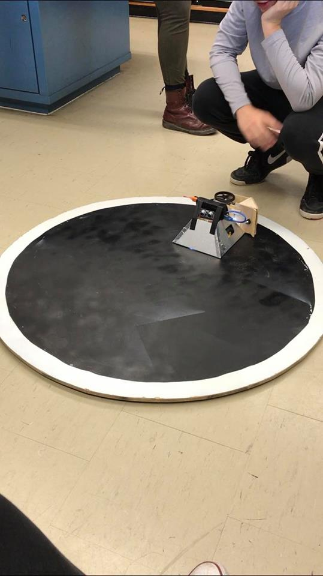
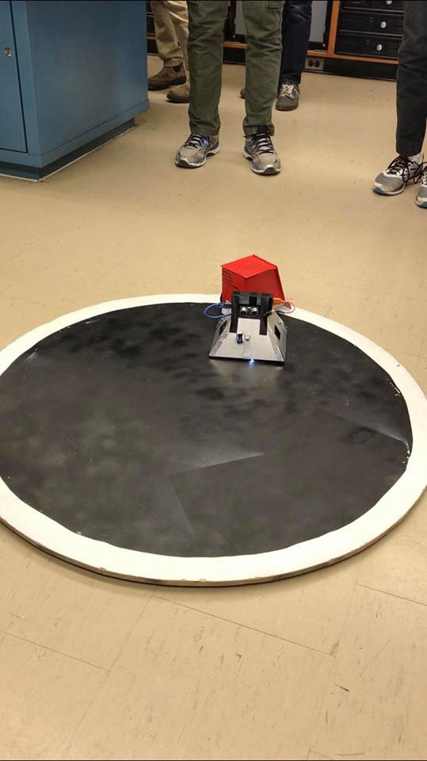

# Sumo-Bot
Code for a Sumo-Bot competition robot written in ArduinoC. Sumo-Bot is a self-controlled robot, powered by an Arduino with a 4-channel motor shield. It uses 4 HC-SR04 Ultrasonic Sensors to detect objects within 50 cm in front, behind, and on either side of the robot. The robot was designed to compete in Sumo-Bot competitions in school and it was one of the top 3 winners.

## Screenshots
Additional videos found in the Screenshot folder

